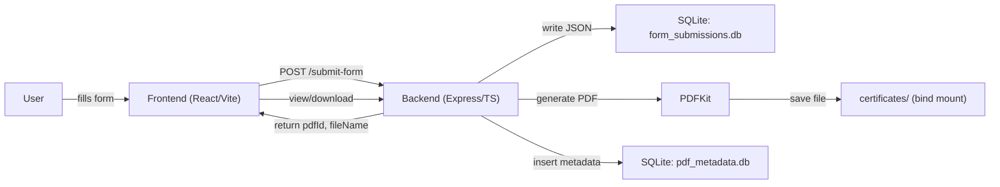
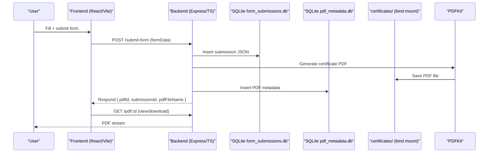

# Birth Certificate Microservice

A complete end-to-end microservice that handles birth certificate applications, stores data locally, generates PDFs, and provides a web interface for management.

## Quick Start

1. **Backend**: `http://localhost:3001`
2. **Frontend**: `http://localhost:8080`

### Run with Docker (recommended)

From the project root:

# Birth Certificate Microservice

A complete end-to-end microservice that handles birth certificate applications, stores data locally, generates PDFs, and provides a web interface for management.

## Quick Start

1. **Backend**: `http://localhost:3001`
2. **Frontend**: `http://localhost:8080`

### Run with Docker (recommended)

From the project root:

```bash
docker compose up --build -d
```

Services:
- Backend: `birth-backend` on port `3001`
- Frontend: `birth-frontend` on port `8080`

To stop:

```bash
docker compose down
```

If you previously used an older compose with `api`/`db` services, clean up orphans:

```bash
docker compose down --remove-orphans
```

## Features

- **Form Submission**: Complete birth certificate application form with validation
- **Local Data Storage**: SQLite database for form submissions and PDF metadata
- **PDF Generation**: Automatic PDF generation with professional formatting
- **PDF Management**: View and download the certificate generated for the current submission
- **Modern UI**: React-based frontend with shadcn/ui components
- **Real-time Updates**: Success card with direct view/download after form submission

## Architecture

### Backend (Node.js + Express + TypeScript)
- **Server**: Express.js server running on port 3001
- **Database**: SQLite with two databases:
  - `form_submissions.db`: Stores form data
  - `pdf_metadata.db`: Stores PDF file information
- **PDF Generation**: PDFKit for creating professional birth certificates
- **File Storage**: Local `certificates/` folder for PDF storage

### Frontend (React + TypeScript + Vite)
### Diagrams

Architecture (flow):



Sequence:


- **Framework**: React 18 with TypeScript
- **UI Components**: shadcn/ui component library
- **Styling**: Tailwind CSS
- **Form Handling**: React Hook Form
- **Server**: Vite dev server on port 8080 (for local dev)

## Getting Started

### Prerequisites
- Node.js 18+ 
- npm or yarn

### Installation (without Docker)

1. **Clone the repository**
   ```bash
   git clone <repository-url>
   cd birth-certificate-microservice
   ```

2. **Install backend dependencies**
   ```bash
   cd backend
   npm install
   ```

3. **Install frontend dependencies**
   ```bash
   cd ../frontend
   npm install
   ```

### Running the Application (without Docker)

1. **Start the backend server**
   ```bash
   cd backend
   npm run build
   npm start
   ```
   The backend will run on `http://localhost:3001`

2. **Start the frontend development server**
   ```bash
   cd frontend
   npm run dev
   ```
   The frontend will run on `http://localhost:8080`

3. **Open your browser** and navigate to `http://localhost:8080`

## Usage

1. Fill out the application form
2. Provide Aadhaar consent when prompted
3. Submit the form
4. The generated certificate will appear in a success card with View and Download buttons

## API Endpoints

### Backend API

- `POST /submit-form` - Submit birth certificate application
- `GET /pdf/:id` - View/download a specific PDF
- `GET /pdfs` - List all generated PDFs (used for internal management; not exposed in UI)
- `GET /submission/:id` - Get submission data by ID

### Request/Response Examples

**Submit Form:**
```json
POST /submit-form
{
  "formData": {
    "firstName": "John",
    "lastName": "Doe",
    "dateOfBirth": "1990-01-01",
    "gender": "male",
    "placeOfBirth": "Mumbai",
    "fatherName": "John Doe Sr.",
    "fatherAadhaarNumber": "123456789012",
    "motherName": "Jane Doe",
    "motherAadhaarNumber": "987654321098"
  }
}
```

**Response:**
```json
{
  "message": "Form data submitted and PDF generated successfully!",
  "pdfId": 1,
  "submissionId": 1,
  "pdfFileName": "birth_certificate_1_1234567890.pdf"
}
```

## Docker Details

- Compose file runs two services:
  - `backend` (Node + Express, port 3001)
  - `frontend` (Nginx serving Vite build, port 8080)
- Bind mounts:
  - `backend/certificates` → persists generated PDFs
  - `backend/form_submissions.db` and `backend/pdf_metadata.db` → persist SQLite databases
- The frontend service uses a custom `nginx.conf` to handle single-page application routing.

Environment variables are passed to the frontend container during the build process to ensure it can communicate with the backend service.

## Database Schema

### Form Submissions Table
```sql
CREATE TABLE submissions (
  id INTEGER PRIMARY KEY AUTOINCREMENT,
  data TEXT
);
```

### PDF Metadata Table
```sql
CREATE TABLE pdfs (
  id INTEGER PRIMARY KEY AUTOINCREMENT,
  submissionId INTEGER NOT NULL,
  filePath TEXT NOT NULL,
  fileName TEXT NOT NULL,
  createdAt DATETIME DEFAULT CURRENT_TIMESTAMP
);
```

## File Structure

```
├── backend/
│   ├── src/
│   │   ├── index.ts          # Main server file
│   │   ├── database.ts       # Form submissions database
│   │   └── pdfDatabase.ts    # PDF metadata database
│   ├── pdfGenerator.ts       # PDF generation logic
│   ├── certificates/         # Generated PDF storage
│   └── package.json
├── frontend/
│   ├── src/
│   │   ├── components/
│   │   │   ├── BirthCertificateForm.tsx
│   │   │   ├── PdfList.tsx
│   │   │   └── ui/           # shadcn/ui components
│   │   ├── types/
│   │   │   └── birth-certificate.ts
│   │   └── App.tsx
│   └── package.json
└── README.md
```

## Development

### Building for Production (without Docker)

**Backend:**
```bash
cd backend
npm run build
npm start
```

**Frontend:**
```bash
cd frontend
npm run build
npm run preview
```

### Environment Variables

For production deployments, you may want to configure the frontend to read an API base URL:

```typescript
const API_BASE_URL = import.meta.env.VITE_API_URL || 'http://localhost:3001';
```

## Troubleshooting

- **Ports in use**: Change backend port in `backend/src/index.ts` or frontend dev port in `frontend/vite.config.ts`.
- **PDF not opening**: Ensure `backend` is running and the `certificates` folder is mounted.
- **Database errors**: Ensure the backend container has write permissions for the mounted `.db` files.

## License

This project is licensed under the ISC License.

## Support

For issues and questions, please check the troubleshooting section or create an issue in the repository.
